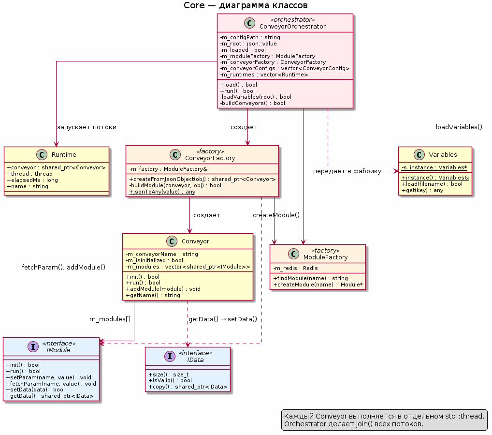
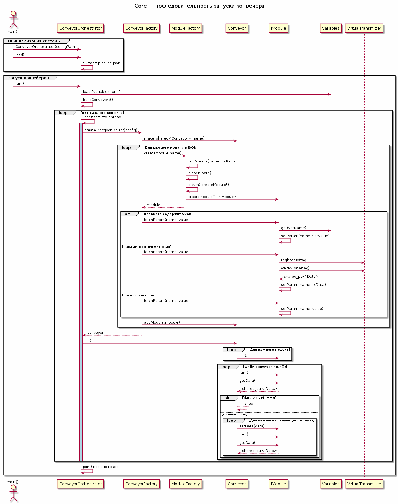

# Core — оркестрация конвейеров

## Обзор

Компонент **Core** отвечает за создание, инициализацию и выполнение конвейеров обработки. Он читает конфигурацию из `pipeline.json`, создаёт цепочки модулей, запускает каждую цепочку в отдельном потоке и ожидает завершения всех потоков.

Ключевые классы:
- **ConveyorOrchestrator** — верхнеуровневая оркестрация всей системы
- **ConveyorFactory** — создание конвейера из JSON-объекта
- **Conveyor** — выполнение одной цепочки модулей
- **ModuleFactory** — динамическая загрузка модулей (`.so`)

---

## ConveyorOrchestrator

`ConveyorOrchestrator` — точка входа для запуска системы. Это единственный класс, который знает о существовании всех конвейеров одновременно.

### Поля

| Поле | Тип | Назначение |
|---|---|---|
| `m_configPath` | `string` | Путь к `pipeline.json` |
| `m_root` | `boost::json::value` | Распарсенный JSON конфига |
| `m_loaded` | `bool` | Флаг успешной загрузки JSON |
| `m_moduleFactory` | `ModuleFactory` | Фабрика модулей |
| `m_conveyorFactory` | `ConveyorFactory` | Фабрика конвейеров |
| `m_conveyorConfigs` | `vector<ConveyorConfig>` | JSON-объекты конвейеров |
| `m_runtimes` | `vector<Runtime>` | Конвейер + поток + время выполнения |

### Метод `load()`

Открывает `pipeline.json`, читает содержимое и парсит через `boost::json::parse`. При ошибке — логирует причину и возвращает `false`. Этот метод отделён от `run()` намеренно: он позволяет проверить валидность конфигурации до запуска потоков, что упрощает отладку.

### Метод `run()` — основной метод

Метод `run()` управляет полным жизненным циклом системы. Сначала он проверяет, что JSON был успешно загружен. Затем загружает глобальные переменные из `variables.toml` через синглтон `Variables`. После этого извлекает массив конвейеров из JSON и для каждого конфига создаёт `std::thread`. Внутри потока `ConveyorFactory` строит конвейер: создаёт объект `Conveyor`, динамически загружает модули, вызывает `fetchParam` для каждого параметра и добавляет модули в цепочку. Затем вызывается `conveyor->init()` — все модули инициализируются. Если `init()` успешна, поток входит в цикл `while (conveyor->run()) {}`, выполняя конвейер до исчерпания данных. По завершении потока Orchestrator сохраняет elapsed time.

После запуска всех потоков Orchestrator делает `join()` для каждого. Это гарантирует, что `main()` не завершится раньше, чем закончат работу всех конвейеры. В конце логируется total time каждого конвейера — полезно для профилирования и выявления узких мест.

Почему каждый конвейер выполняется в собственном потоке? Потому что конвейеры независимы друг от друга, за исключением данных, передаваемых через `VirtualTransmitter`. Параллельное выполнение позволяет загружать GPU вычислениями с нескольких конвейеров одновременно. Если бы конвейеры работали последовательно, GPU простаивал бы во время CPU-операций другого конвейера. Многопоточность максимизирует утилизацию оборудования.

Ошибки внутри потока (исключения или `init() == false`) перехватываются, но основной метод `run()` всё равно дожидается `join()` и возвращает `true`. Это сделано для надёжности: даже если один конвейер упал, остальные должны доработать до конца, а ресурсы должны быть корректно освобождены.

---

## ConveyorFactory

`ConveyorFactory` создаёт конвейер из JSON-конфигурации. Он инкапсулирует всю логику превращения декларативного описания в работающую цепочку объектов.

### Метод `createFromJsonObject(conveyorObj)`

Извлекает `"name"` — имя конвейера (обязательно). Создаёт `Conveyor(name)`. Извлекает `"modules"` — массив JSON-объектов. Для каждого модуля вызывает `buildModule(conveyor, moduleObj)`. Возвращает готовый конвейер.

Этот метод удобен, потому что он централизует логику парсинга JSON. Модульный разработчик не должен знать, как устроен JSON: он получает уже готовые параметры через `setParam`. А администратор системы может менять пайплайны, просто редактируя текстовый файл, без перекомпиляции.

### Метод `buildModule(conveyor, moduleObj)`

Извлекает `"name"` — имя модуля. Вызывает `ModuleFactory::createModule(name)` для создания экземпляра. Затем получает метаданные через `module->getMetaData()` и определяет абсолютный путь к `module.json`: `ModuleFactory::findModule(name)` возвращает путь к `.so`, а `module.json` ищется в той же директории (берётся поле `jsonModuleFilePath` из метаданных и преобразуется в абсолютный путь). На основе этого пути создаётся `ModuleMethaDataReader`, который парсит `module.json` и извлекает ожидаемые типы параметров.

Если в JSON конвейера есть `"params"`, для каждого параметра вызывается `module->fetchParam(name, convertParamValue(value, reader, name))`. `convertParamValue` использует тип из метаданных, чтобы корректно преобразовать JSON-значение в C++-тип. Затем модуль добавляется в конвейер через `conveyor.addModule(module)`.

Здесь важен порядок: сначала создание, потом чтение метаданных, потом типизированная параметризация, потом добавление. Если `fetchParam` вернёт `false` (например, переменная не найдена или таймаут `@tag`), модуль не добавляется, а конвейер помечается как невалидный.

Типизированная конвертация решает проблему потери точности, которая раньше возникала при использовании `jsonToAny`: например, `int64` из JSON мог сворачиваться в `int32_t`, что приводило к переполнению больших значений. Теперь тип известен заранее из `module.json`, и конвертация производится согласно контракту модуля.

### Метод `convertParamValue(value, reader, paramName)`

Типизированная конвертация `boost::json::value` → `std::any` с учётом метаданных модуля:

| Ожидаемый тип | JSON-тип | C++-тип |
|---|---|---|
| `int` / `int64_t` | `int64` | `int64_t` (или `int` для `int`) |
| `int` / `int64_t` | `double` | приводится к `int64_t` / `int` |
| `double` | `double` | `double` |
| `double` | `int64` | приводится к `double` |
| `bool` | `bool` | `bool` |
| `std::string` | `string` | `std::string` |
| `std::string` | `int64` / `double` / `bool` | конвертируется в строку |
| неизвестен | любой | fallback на `jsonToAny` |

Строки всегда передаются как есть — `fetchParam` позже разрешит в них переменные (`$VAR`) и теги (`@tag`). Если `module.json` не найден или параметр в нём не описан, `convertParamValue` делегирует в `jsonToAny`.

### Метод `jsonToAny(value)`

Базовая конвертация `boost::json::value` → `std::any` без учёта метаданных. Используется как fallback, когда тип параметра неизвестен:

| JSON-тип | C++-тип |
|---|---|
| `string` | `std::string` |
| `bool` | `bool` |
| `int64` | `int64_t` |
| `double` | `double` |
| `null` | пустой `std::any` |

Эта конвертация остаётся в коде для обратной совместимости и для случаев, когда `module.json` недоступен. В основном же потоке теперь работает `convertParamValue`, которая опирается на метаданные и гарантирует, что модуль получит ожидаемый тип — например, `int64_t` вместо `int32_t` для больших целых значений.

### Метаданные модуля

Перед типизированной конвертацией `ConveyorFactory` опирается на два вспомогательных объекта:

**`ModuleMetaData`** — структура, которую модуль возвращает через `getMetaData()`:

| Поле | Тип | Назначение |
|---|---|---|
| `moduleName` | `std::string` | Имя модуля |
| `libraryFilePath` | `std::string` | Путь к `.so` (заполняется модулем) |
| `jsonModuleFilePath` | `std::string` | Относительный путь к `module.json` (рядом с `.so`) |

**`ModuleMethaDataReader`** — читает `module.json` и строит карту `имя параметра → type_index`. Формат `module.json` ожидает массив `fields`, где каждое поле содержит `name` и `type`. Поддерживаемые типы:

| Тип в `module.json` | C++-тип (`type_index`) |
|---|---|
| `string` | `std::string` |
| `enum` | `std::string` |
| `int` | `int64_t` |
| `real` | `double` |
| `bool` | `bool` |

`ModuleMethaDataReader` открывает файл при конструировании и парсит его через `boost::json`. Если файл не существует или повреждён, метод `getParamType` возвращает `typeid(void)`, и `ConveyorFactory` откатывается на `jsonToAny`. Это делает систему устойчивой: отсутствие `module.json` не ломает загрузку, но лишает конвейер типобезопасности.

---

## Conveyor

`Conveyor` — исполнитель одной цепочки модулей. Он содержит минимум логики: просто вызывает модули в правильном порядке и контролирует поток данных.

### Поля

| Поле | Тип | Назначение |
|---|---|---|
| `m_conveyorName` | `string` | Имя конвейера |
| `m_isInitialized` | `bool` | Флаг инициализации |
| `m_modules` | `vector<shared_ptr<IModule>>` | Цепочка модулей |

### Метод `init()`

Проверяет, что `m_modules` не пуст. Для каждого модуля вызывает `module->init()`. Если любой вернул `false` → возвращает `false`. Устанавливает `m_isInitialized = true`.

Инициализация отделена от выполнения намеренно. На этом этапе модули могут выделить постоянную GPU-память, скомпилировать CUDA-графы, загрузить справочные таблицы. Если инициализация проходит успешно, все тяжёлые операции уже позади, и `run()` работает предсказуемо быстро. Это особенно важно для real-time обработки, где вариативность задержки критична.

### Метод `run()` — одна итерация

Метод выполняет один полный проход по цепочке модулей. Сначала берёт первый модуль (источник) и вызывает его `run()`. Если модуль вернул `false`, конвейер останавливается. Затем забирает данные через `getData()` и проверяет размер. Если `data->size() == 0`, это означает нормальное завершение — например, файл дочитан. Conveyor логирует `"finished"` и возвращает `false`, прерывая внешний цикл.

Если данные есть, Conveyor обходит все остальные модули цепочки. Для каждого следующего модуля он проверяет валидность данных, передаёт их через `setData(data)`, запускает `run()`, замеряет время выполнения и забирает новые данные для следующей итерации. Если любой из промежуточных модулей вернул `false` или `setData` отказался принять данные (неверный тип), конвейер останавливается.

Почему это эффективно? Потому что Conveyor не копирует данные. Он просто передаёт `shared_ptr<IData>` от одного модуля к другому. Вся тяжёлая работа — CUDA-ядра, FFT, фильтрация — происходит внутри модулей, а Conveyor остаётся лёгким оркестратором с минимальным оверхедом.

Ключевой момент: первый модуль (например, `FileSrc`) сам формирует данные. Когда данных больше нет (`size() == 0`), это означает **нормальное завершение** конвейера, а не ошибку.

---

## ModuleFactory

`ModuleFactory` загружает модули как shared libraries. Вместо того чтобы статически линковать все возможные модули в исполняемый файл сервера, фабрика подгружает только те `.so`, которые реально нужны текущему пайплайну.

### Метод `findModule(name)`

Ключ в Redis: `name + "-module"` (например, `"CarrierRecovery-module"`). Возвращает путь к `.so` или пустую строку. Redis здесь выступает централизованным реестром: один и тот же сервер может работать с разными версиями модулей, просто изменяя записи в Redis.

### Метод `createModule(name)`

Сначала вызывает `findModule(name)` для получения пути к `.so`. Затем открывает библиотеку через `dlopen(path, RTLD_LAZY)` — символы разрешаются по мере необходимости, что ускоряет загрузку. После этого `dlsym(moduleHandle, "createModule")` извлекает фабричную функцию. Наконец, функция вызывается и возвращает `IModule*`. Дескриптор `dlopen` нигде не сохраняется — библиотека остаётся загруженной до завершения процесса, а память освобождается ОС при `exit()`.

Это эффективно, потому что время сборки сервера не зависит от количества модулей. Каждый модуль компилируется независимо, и изменение одного модуля не требует пересборки всего приложения. Кроме того, можно обновлять модуль на лету, заменив `.so` на диске, без перезапуска сервера.

---

## Обработка ошибок

Ошибки обрабатываются по-разному на разных этапах. На этапе загрузки (`load()`, `loadVariables()`, `buildConveyors()`) ошибка приводит к возврату `false` — это позволяет вызывающему коду в `main()` корректно завершиться с ненулевым кодом.

При создании конвейера внутри потока исключения перехватываются, и поток завершается. `Conveyor::init()` возвращает `false`, если хотя бы один модуль не смог инициализироваться. Orchestrator логирует ошибку, но не прерывает остальные потоки.

Во время выполнения `Conveyor::run()` возвращает `false` при любой ошибке, и внешний цикл `while` прерывается. Если `data->isValid()` вернул `false` или `setData()` отказался принять данные, конвейер останавливается. Особый случай — `data->size() == 0`: это **нормальное завершение**, означающее, что источник данных исчерпан.

Такая градация обработки удобна, потому что она разделяет фатальные ошибки (невалидный JSON) от Recoverable-ошибок (один конвейер упал, остальные работают). Логирование через Boost.Log сохраняет полный контекст для отладки.

---

## От pipeline.json до работающей цепочки

Весь путь от конфигурационного файла до работающего пайплайна можно описать как последовательность преобразований. На входе — текстовый JSON, описывающий, какие модули в каком порядке должны работать, и с какими параметрами. На выходе — набор потоков, каждый из которых выполняет цепочку CUDA-операций на GPU.

Первое преобразование — парсинг. `ConveyorOrchestrator::load()` читает файл и превращает его в `boost::json::value`. Второе — разрешение переменных. `Variables::load()` читает `variables.toml` и создаёт хранилище ключ-значение. Третье — сборка конвейеров. Для каждого объекта из массива `"conveyors"` создаётся `std::thread`, внутри которого `ConveyorFactory` превращает JSON-объект в `Conveyor` с набором `IModule`.

Сборка модуля — это тоже цепочка преобразований. `ModuleFactory` превращает строку-имя модуля в загруженную `.so` через Redis + `dlopen`. Затем `dlsym` превращает символ в функцию, а функция — в объект `IModule`. Модуль возвращает `ModuleMetaData` через `getMetaData()`, а `ConveyorFactory` строит абсолютный путь к `module.json` и создаёт `ModuleMethaDataReader`. `fetchParam` превращает JSON-значение в типизированный `std::any` через `convertParamValue` с учётом метаданных, а затем разрешает переменные и теги. Если метаданные недоступны, используется `jsonToAny` как fallback. Наконец, модуль добавляется в `Conveyor`.

После сборки начинается выполнение. `Conveyor::init()` превращает набор параметров в инициализированное состояние: CUDA-память выделена, ядра скомпилированы, справочные таблицы загружены. `Conveyor::run()` превращает входные данные в выходные, пропуская их через цепочку модулей. Первый модуль читает файл или получает данные от `VirtualTransmitter`, последний — записывает в файл или публикует через `VirtualTX`. Между ними данные передаются через `shared_ptr` без копирования.

---

## Диаграмма классов

---

## Диаграмма последовательности

