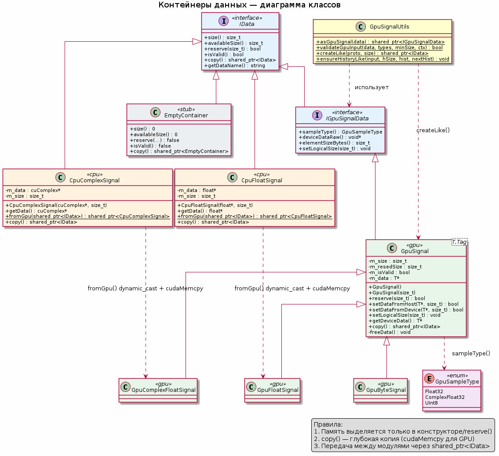

# Контейнеры данных

## Обзор

Система контейнеров данных — это **типобезопасная обёртка** над сырым host/device memory с полиморфной семантикой. Она позволяет модулям обмениваться данными независимо от их реального типа (`float`, `cuComplex`, `uint8_t`) и местоположения (CPU/GPU).

Ключевые принципы:
- **Память выделяется только в конструкторе/`reserve()`**
- **`copy()` создаёт глубокую копию** (через `cudaMemcpy` для GPU)
- **Передача между модулями через `std::shared_ptr<IData>`**
- **Инкапсуляция CUDA-памяти** — `cudaMalloc`/`cudaFree` скрыты внутри класса

---

## Иерархия классов

```
IData (абстрактный базовый)
├── IGpuSignalData (абстрактный, для GPU-данных)
│   └── GpuSignal<T, Tag> (шаблонный, CUDA)
│       ├── GpuFloatSignal      = GpuSignal<float, gpu_float_tag>
│       ├── GpuComplexFloatSignal = GpuSignal<cuComplex, gpu_complex_float_tag>
│       └── GpuByteSignal       = GpuSignal<uint8_t, gpu_byte_tag>
├── CpuFloatSignal  (прямой наследник IData, CPU)
├── CpuComplexSignal (прямой наследник IData, CPU)
└── EmptyContainer  (прямой наследник IData, заглушка)
```

---

## Базовый интерфейс IData

**Файл:** `DataContainers/include/IData.hpp`

Определяет универсальный контракт для всех контейнеров:

| Метод | Назначение |
|---|---|
| `size()` | Логический размер данных **в элементах** (не в байтах) |
| `availableSize()` | Зарезервированный/выделенный размер в элементах (ёмкость буфера) |
| `reserve(size)` | **Единственный метод выделения/перевыделения памяти** |
| `isValid()` | Можно ли использовать данные (память выделена, указатель не `nullptr`) |
| `copy()` | Глубокая копия → возвращает `std::shared_ptr<IData>` |
| `getDataName()` | Имя канала логирования/идентификации контейнера |

Ключевое правило: *«Память выделяется только в конструкторе»* (и в `reserve()`). Все контейнеры содержат `boost::log` logger с channel = имени контейнера.

---

## Интерфейс GPU-данных IGpuSignalData

**Файл:** `DataContainers/include/IGpuSignalData.hpp`

Наследует `IData`, добавляет runtime-типизацию для GPU-контейнеров:

| Метод | Назначение |
|---|---|
| `sampleType()` | Возвращает `GpuSampleType` (`Float32`, `ComplexFloat32`, `UInt8`) |
| `deviceDataRaw()` | `void*` — сырой указатель на device-память (для generic-кода) |
| `elementSizeBytes()` | Размер одного элемента в байтах (`sizeof(T)`) |
| `setLogicalSize(size)` | Устанавливает логический размер **без** перевыделения (если `size ≤ availableSize`) |

Позволяет модулям работать с GPU-данными, не зная конкретного шаблонного типа `T`, до момента запуска CUDA-ядра.

---

## Шаблонный класс GpuSignal<T, Tag>

**Файлы:** `DataContainers/include/GpuSignal.hpp`, `DataContainers/src/GpuSignal.cpp`

Трёхпараметрический шаблон (фактически два параметра: тип `T` и тег `Tag` для имени). CRTP-подобный паттерн с `GpuSampleTypeTraits<T>` для маппинга типа на `GpuSampleType`.

### Поля

```cpp
size_t m_size = 0;        // логический размер (активные элементы)
size_t m_resedSize = 0;   // зарезервированный размер (allocated capacity)
bool   m_isValid = false; // флаг валидности
T*     m_data = nullptr;  // device pointer (cudaMalloc)
```

### Конструкторы

- `GpuSignal()` — пустой, невалидный
- `GpuSignal(size_t size)` — выделяет через `cudaMalloc(sizeof(T) * size)`
- Move-конструктор/оператор — **перемещает** владение указателем, обнуляет источник
- **Копирование запрещено** (`= delete`)

### Ключевые методы

| Метод | Описание |
|---|---|
| `reserve(size)` | Если `size == 0` → освобождает. Если `size ≤ m_resedSize` → **не перевыделяет** (guard от down-malloc), просто помечает валидным. Иначе `cudaFree` + `cudaMalloc`. |
| `setDataFromHost(T* data, size)` | `cudaMemcpyHostToDevice`, проверяет `size ≤ m_resedSize` |
| `setDataFromDevice(T* data, size)` | `cudaMemcpyDeviceToDevice` |
| `setLogicalSize(size)` | Устанавливает `m_size` без перевыделения; `size` не может превышать `m_resedSize` |
| `getDeviceData()` | Типизированный `T*` (const и non-const) |
| `copy()` | **Глубокая копия**: `cudaMalloc` нового буфера + `cudaMemcpyDeviceToDevice` |

### Поддерживаемые типы

| Тип C++ | Alias | GpuSampleType |
|---|---|---|
| `float` | `GpuFloatSignal` | `Float32` |
| `cuComplex` | `GpuComplexFloatSignal` | `ComplexFloat32` |
| `uint8_t` | `GpuByteSignal` | `UInt8` |

---

## CPU-контейнеры

### CpuFloatSignal / CpuComplexSignal

**Файлы:** `DataContainers/include/CpuFloatSignal.hpp`, `CpuComplexSignal.hpp`

Наследуют `IData` напрямую (не `IGpuSignalData`). Хранят данные в host-памяти (`new[]`/`delete[]`).

| Метод | Описание |
|---|---|
| `getData()` | Возвращает `float*` / `cuComplex*` |
| `fromGpu(shared_ptr<IData>)` | **Статическая фабрика**: делает `dynamic_pointer_cast` к соответствующему `Gpu*Signal`, затем `cudaMemcpyDeviceToHost` в `new T[...]` |
| `reserve(size)` | Всегда возвращает `true` (CPU-контейнер не управляет динамическим резервированием; память передаётся извне) |
| `copy()` | Глубокая копия через `std::memcpy` в `new T[m_size]` |

**Важно:** конструкторы принимают **уже выделенный** указатель (`float* data, size_t size`), контейнер берёт на себя владение (`delete[]` в деструкторе).

---

## EmptyContainer

**Файл:** `DataContainers/include/EmptyContainer.hpp`

Заглушка-«нулевой объект»:

| Метод | Результат |
|---|---|
| `size()` | `0` |
| `availableSize()` | `0` |
| `reserve(...)` | `false` |
| `isValid()` | `false` |
| `copy()` | `std::make_shared<EmptyContainer>()` |

Используется как сигнал «данных нет» или начальное состояние. `VirtualTX` отправляет `EmptyContainer` при уничтожении как сигнал завершения.

---

## Зачем обёртки, а не сырые указатели

### 1. Полиморфная передача через `std::shared_ptr<IData>`

Модули в конвейере общаются через единый интерфейс:

```cpp
void setData(std::shared_ptr<IData> data);
std::shared_ptr<IData> getData();
```

Модуль может принимать `float`, `complex` или `uint8_t` — не зная заранее, что ему придёт. Он работает с `IGpuSignalData` и `GpuSampleType` для runtime-типизации.

### 2. Глубокое копирование (deep copy) для VirtualTransmitter

`VirtualTransmitter` рассылает данные нескольким RX-получателям. Каждый получатель должен иметь **независимую** копию. Метод `copy()` создаёт глубокую копию:
- Для GPU: `cudaMalloc` + `cudaMemcpyDeviceToDevice`
- Для CPU: `new[]` + `std::memcpy`

Тесты (`data_container_copy_tests.cpp`) явно проверяют: *«Изменение копии не влияет на оригинал»*.

### 3. Типобезопасность + runtime-типизация

- `GpuSampleType` + `GpuSampleTypeTraits<T>` позволяют generic-коду понимать, с чем он работает, без шаблонов.
- `validateGpuInput()` в `GpuSignalUtils.hpp` централизованно проверяет: не `nullptr`, валиден, допустимый тип, достаточный размер.
- `dynamic_pointer_cast` используется для строгой типизации при CPU↔GPU конвертации.

### 4. Инкапсуляция управления CUDA-памятью

`GpuSignal` полностью скрывает `cudaMalloc` / `cudaFree`:
- Деструктор вызывает `freeData()` → `cudaFree`
- Move-семантика предотвращает double-free
- `reserve()` реализует оптимизацию «не перевыделять, если влезает» (buffer reuse)

### 5. Единое правило жизненного цикла

`IData` гарантирует, что память выделяется только в конструкторе/`reserve()`. Это упрощает отладку утечек и делает поведение предсказуемым.

---

## Утилиты: GpuSignalUtils

**Файл:** `DataContainers/include/GpuSignalUtils.hpp`

Содержит вспомогательные inline-функции для модулей:

| Функция | Назначение |
|---|---|
| `asGpuSignal(data)` | Безопасный `dynamic_pointer_cast<IGpuSignalData>` |
| `validateGpuInput(data, allowedTypes, minSize, context)` | Цепочка проверок: `nullptr` → `isValid()` → тип → размер → указатель |
| `createLike(prototype, size)` | Фабрика: создаёт GPU-контейнер того же `GpuSampleType`, что и `prototype` |
| `ensureHistoryLike(input, historySize, history, nextHistory)` | Управление буферами истории для скользящей обработки (например, FIR): создаёт/переиспользует буферы, обнуляет `cudaMemset` |

---

## Передача данных между модулями

1. Модуль `A` создаёт/обрабатывает данные, упаковывает в `std::shared_ptr<IData>` (например, `GpuFloatSignal`)
2. `Conveyor` вызывает `A->getData()` → получает `shared_ptr<IData>`
3. Передаёт в модуль `B` через `B->setData(data)`
4. `B` может привести тип: `asGpuSignal(data)` → `validateGpuInput(...)` → `deviceDataRaw()` / `getDeviceData()`
5. Для межконвейерной передачи (`VirtualTX` → `VirtualRX`) `VirtualTransmitter` делает `copy()`, чтобы каждый RX получил независимый экземпляр

---

## Диаграмма классов



---

## Ключевые файлы

| Файл | Описание |
|---|---|
| `DataContainers/include/IData.hpp` | Базовый интерфейс данных |
| `DataContainers/include/IGpuSignalData.hpp` | Интерфейс GPU-данных |
| `DataContainers/include/GpuSignal.hpp` | Шаблонный GPU-контейнер |
| `DataContainers/src/GpuSignal.cpp` | Реализация GpuSignal |
| `DataContainers/include/CpuFloatSignal.hpp` | CPU-контейнер float |
| `DataContainers/include/CpuComplexSignal.hpp` | CPU-контейнер complex |
| `DataContainers/include/EmptyContainer.hpp` | Пустой контейнер-заглушка |
| `DataContainers/include/GpuSignalUtils.hpp` | Утилиты для модулей |
| `tests/data_container_copy_tests.cpp` | Тесты копирования |
