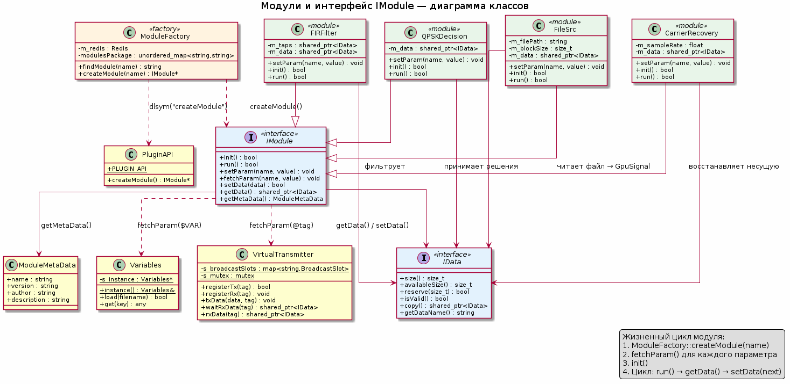

# Модули и интерфейс IModule

## Обзор

Проект `computing_server` построен по модульной архитектуре: каждый этап обработки сигнала реализован как отдельный динамически загружаемый модуль (shared library `.so`). Модули объединяются в цепочки — **конвейеры** — через декларативную конфигурацию `pipeline.json`. Такой подход позволяет собирать произвольные пайплайны обработки, не переписывая код сервера.

Ключевые особенности:
- **20+ модулей** обработки (FIR-фильтрация, FFT, демодуляция, декимация и др.)
- **Динамическая загрузка** через `dlopen`/`dlsym` с разрешением путей через Redis
- **Единый интерфейс** `IModule` для всех модулей
- **Полиморфная передача данных** через `std::shared_ptr<IData>`
- **Три режима параметризации**: прямые значения, подстановка `$VAR` из `variables.toml`, ссылка `@tag` на данные из другого конвейера

---

## Интерфейс IModule

Каждый модуль реализует интерфейс `IModule` (`Module/include/IModule.hpp`). Это единый контракт, который позволяет Conveyor запускать модули, не зная их внутреннего устройства.

| Метод | Назначение |
|---|---|
| `init()` | Инициализация: проверка параметров, подготовка структур, warm-up CUDA-ядра. Возвращает `true` при успехе. |
| `run()` | Основная логика обработки. Возвращает `true` при успехе. |
| `setParam(name, value)` | Установка параметра модуля. Каждый модуль сам знает, какие параметры он принимает. |
| `fetchParam(name, value)` | **Невиртуальный** метод из `IModule.cpp`. Разрешает переменные (`$VAR`, `@tag`) перед вызовом `setParam`. |
| `setData(data)` | Получение входных данных от предыдущего модуля в цепочке. |
| `getData()` | Возврат обработанных данных следующему модулю. |
| `getMetaData()` | Возврат метаданных модуля (имя, версия, описание). |

### Жизненный цикл

Модуль проходит через три фазы.

**Фаза создания.** `ModuleFactory` ищет имя модуля в Redis, получает путь к `.so`, загружает библиотеку через `dlopen`, извлекает фабричную функцию `createModule` через `dlsym` и вызывает её. На выходе — сырой указатель `IModule*`, который Conveyor заворачивает в `shared_ptr`. Важно, что серверу не нужно знать ни пути к модулю, ни его зависимости на этапе компиляции: всё разрешается runtime через Redis.

**Фаза параметризации.** Сразу после создания ConveyorFactory обходит все параметры из `pipeline.json` и для каждого вызывает `fetchParam`. Этот метод — «умный мост» между JSON и C++: он распознаёт три вида значений и преобразует их в `std::any`. Если значение начинается с `$`, `fetchParam` подменяет его на переменную из `variables.toml`. Если со `@`, модуль регистрируется как получатель данных через `VirtualTransmitter` и блокируется до их поступления. Обычное значение передаётся в `setParam` как есть. Такой подход удобен, потому что один и тот же `pipeline.json` можно запускать с разными наборами параметров, просто подменяя `variables.toml` — например, для dev- и prod-окружений.

**Фаза выполнения.** После успешной `init()` Conveyor входит в цикл: запускает первый модуль (источник данных), забирает результат через `getData()`, проверяет валидность и размер, и передаёт следующему модулю через `setData()`. Цикл продолжается, пока источник не вернёт пустой контейнер (`size() == 0`), что означает нормальное завершение.

---

## Динамическая загрузка модулей

### ModuleFactory

`ModuleFactory` (`Core/include/ModuleFactory.hpp`) отвечает за создание экземпляров модулей. Вместо статической линковки всех модулей в один бинарник сервер загружает только те `.so`, которые упомянуты в `pipeline.json`.

Загрузка происходит в четыре шага. Сначала по имени модуля запрашивается Redis по ключу `"<ModuleName>-module"` (например, `"FileSrc-module"`). Redis возвращает абсолютный путь к `.so`. Затем библиотека открывается через `dlopen(libPath, RTLD_LAZY)` — символы разрешаются лениво, что ускоряет старт. После этого `dlsym(moduleHandle, "createModule")` извлекает фабричную функцию. Наконец, функция вызывается и возвращает `IModule*`. Дескриптор `dlopen` не сохраняется явно: библиотека остаётся загружена до завершения процесса, а память освобождается ОС при `exit()`.

Этот подход эффективен по нескольким причинам. Во-первых, время сборки сервера не зависит от количества модулей: каждый модуль компилируется параллельно и не требует перелинковки всего приложения при изменении. Во-вторых, можно обновлять отдельный модуль, просто заменив `.so` на диске, без остановки Redis и без пересборки Core. В-третьих, Redis как реестр позволяет разным инстансам сервера использовать разные версии модулей — полезно для A/B-тестирования.

**Требования runtime:** запущенный Redis (`127.0.0.1:6379`) и переменная окружения `REDISCLI_AUTH` с паролем.

### Plugin API

Каждый модуль экспортирует фабричную функцию через единый макрос (`Modules/module.hpp`):

```cpp
#define PLUGIN_API extern "C" __attribute__((visibility("default")))

PLUGIN_API IModule* createModule();
```

Макрос `PLUGIN_API` гарантирует, что символ `createModule` попадёт в динамическую таблицу символов библиотеки и будет виден `dlsym`. Без `extern "C"` компилятор применит C++ name mangling, и `dlsym` не найдёт функцию по простому имени. Без `visibility("default")` символ может быть скрыт на уровне всей библиотеки, если используется флаг `-fvisibility=hidden`. Таким образом, `PLUGIN_API` — это минимальный, но надёжный контракт между сервером и плагином.

---

## Разрешение параметров: fetchParam

Метод `fetchParam` реализован в `Module/src/IModule.cpp` и предоставляет три механизма подстановки значений. Он вызывается единообразно для всех параметров, поэтому модуль не должен сам заботиться о разрешении переменных — это упрощает код модуля и устраняет дублирование логики.

### 1. Прямое значение
```json
{ "name": "FIR-filter", "params": { "decimation": 4 } }
```
Значение передаётся в `setParam` как есть. Это самый быстрый путь — никаких поисков и блокировок.

### 2. Подстановка переменной `$VAR`
```json
{ "name": "Decimator", "params": { "factor": "$DECIMATION_FACTOR" } }
```
Строка начинается с `$`. Значение ищется в синглтоне `Variables`, который загружает `variables.toml`. Если переменная не найдена, `fetchParam` логирует ошибку и возвращает `false`, что приводит к остановке сборки конвейера.

Это удобно, когда одно и то же число используется в десятках мест. Например, частота дискретизации может фигурировать в `FileSrc`, `CarrierRecovery`, `SpectrogramPlot` и других модулях. Изменение в одном месте `variables.toml` автоматически распространяется на все модули, исключая рассинхронизацию параметров.

### 3. Ссылка на данные `@tag`
```json
{ "name": "FIR-filter", "params": { "taps": "@fir_rrc_coeff" } }
```
Строка начинается с `@`. Модуль регистрируется как получатель (`registerRx`) и **блокируется** в `waitRxData`, ожидая данные от другого конвейера. Полученные данные (`shared_ptr<IData>`) передаются в `setParam`.

Этот механизм эффективен, потому что позволяет строить многоконвейерные пайплайны без жёсткого связывания модулей на уровне кода. Конвейер, вычисляющий коэффициенты фильтра, не знает, кто и когда их использует. Он просто публикует данные под тегом. А конвейер фильтрации подписывается на тот же тег. Синхронизация происходит автоматически — через блокирующее ожидание на старте.

---

## Примеры модулей

### FileSrc
- **Назначение:** Чтение бинарных данных из файла (mmap или блочное чтение)
- **Параметры:** `filePath` (string), `blockSize` (int)
- **Логика:** При `run()` читает очередной блок данных из файла и упаковывает в `GpuSignal`. Когда файл кончился — `getData()` возвращает контейнер с `size() == 0`, что сигнализирует конвейеру об остановке.

Почему это удобно: модуль сам управляет файловым дескриптором и курсором чтения. Conveyor не знает ни о файлах, ни о размерах блоков — он просто вызывает `run()` и проверяет размер данных. Это позволяет заменить `FileSrc` на источник из сети или Redis-стрима, не меняя код Conveyor.

### FIR-filter
- **Назначение:** FIR-фильтрация сигнала (включая RRC)
- **Параметры:** `taps` (shared_ptr<IData> — коэффициенты фильтра), `decimation` (int)
- **Логика:** Получает входной сигнал и коэффициенты, запускает CUDA-ядро свёртки. Поддерживает буфер истории через `ensureHistoryLike`.

Эффективность здесь достигается за счёт того, что коэффициенты `taps` передаются один раз — через `@tag` — и не копируются на каждой итерации. Сам сигнал передаётся через `shared_ptr` без копирования внутри конвейера. CUDA-ядро выполняет свёртку на GPU, не поднимая данные на CPU. Буфер истории позволяет обрабатывать сигнал блочно, не теряя краевые эффекты между блоками.

### CarrierRecovery
- **Назначение:** Восстановление несущей частоты (фазовая синхронизация)
- **Параметры:** `sampleRate` (float), `loopBandwidth` (float)
- **Логика:** Оценивает и компенсирует частотный и фазовый сдвиг во входном комплексном сигнале.

### QPSKDecision
- **Назначение:** Принятие решений по символам QPSK
- **Параметры:** `threshold` (float)
- **Логика:** По восстановленным символам определяет переданные биты.

---

## Передача данных внутри конвейера

Модули в одном конвейере обмениваются данными через `std::shared_ptr<IData>`. Это ключевое архитектурное решение, которое обеспечивает zero-copy семантику внутри одной цепочки.

Когда модуль `A` завершает `run()`, он возвращает `getData()` — `shared_ptr<IData>`, указывающий на GPU-память. `Conveyor` проверяет `data->isValid()` и `data->size()`, затем передаёт тот же `shared_ptr` в модуль `B` через `setData(data)`. Пока Conveyor и модуль `B` держат `shared_ptr`, память остаётся валидной. Никакого копирования CUDA-памяти не происходит.

Это эффективно по двум причинам. Во-первых, пропускная способность между модулями ограничена только скоростью передачи указателя — а не пропускной способностью PCIe, как было бы при копировании. Во-вторых, модуль `B` может быть уверен, что данные живут минимум до следующего вызова `getData()` в `B`, потому что `Conveyor` держит `shared_ptr` в локальной переменной на всё время итерации.

Модуль `B` может привести тип: `asGpuSignal(data)` → `validateGpuInput(...)` → работа с `deviceDataRaw()`. Приведение типа — `dynamic_pointer_cast` — безопасно и не требует копирования данных.

Копирование происходит **только** при межконвейерной передаче через `VirtualTransmitter`. Это необходимо, потому данные могут одновременно нужны нескольким получателям, и каждый получатель имеет право модифицировать их (например, дописать историю FIR-фильтра).

---

## Диаграмма классов


