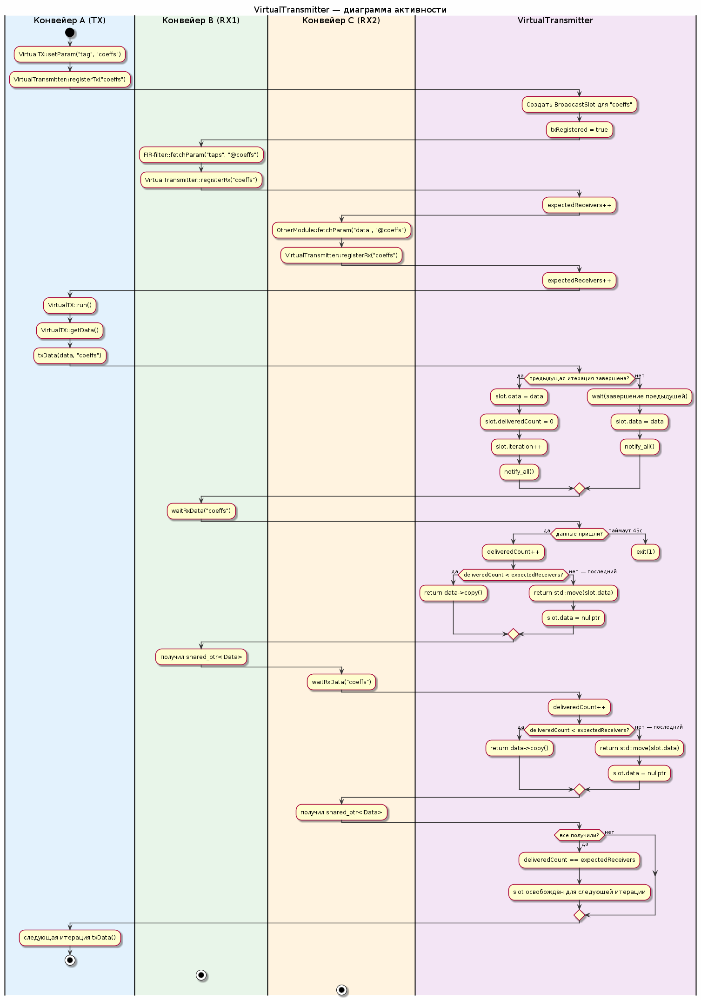

# Виртуальная передача данных (VirtualTransmitter)

## Обзор

`VirtualTransmitter` — механизм **широковещательной рассылки данных между конвейерами**. Он позволяет одному конвейеру отправить обработанные данные, а другим конвейерам — получить их по именованному тегу.

Ключевые особенности:
- **Статический брокер** — один на всё приложение (singleton-подобный подход через статические члены)
- **BroadcastSlot** — ячейка хранения данных для конкретного тега
- **Оптимизация копирования** — первые N-1 получателей получают копию, последний забирает оригинал через `std::move`
- **Блокирующее ожидание** — при использовании `@tag` в `pipeline.json` инициализация модуля блокируется до получения данных
- **Таймаут 45 секунд** — при превышении процесс завершается через `exit(1)`

---

## Архитектура

### BroadcastSlot

Каждый тег имеет слот, хранящий:

| Поле | Тип | Назначение |
|---|---|---|
| `data` | `shared_ptr<IData>` | Данные для рассылки (`nullptr`, когда все получили) |
| `expectedReceivers` | `size_t` | Ожидаемое количество получателей (авто-подсчёт через `registerRx`) |
| `deliveredCount` | `size_t` | Сколько RX уже забрали данные |
| `iteration` | `size_t` | Номер итерации рассылки |
| `txRegistered` | `bool` | Зарегистрирован ли отправитель (один тег = один TX) |
| `mutex` | `mutex` | Синхронизация доступа к слоту |
| `condition` | `condition_variable` | Уведомление получателей о новых данных |

### VirtualTransmitter

Реализован через статические члены:

| Поле | Тип | Назначение |
|---|---|---|
| `s_broadcastSlots` | `map<string, BroadcastSlot>` | Все слоты по тегам |
| `s_mutex` | `mutex` | Глобальная блокировка для `s_broadcastSlots` |
| `s_timeoutMs` | `long long` | Таймаут ожидания — 45 000 мс |

---

## Методы

### `registerTx(tag)`
- Регистрирует отправителя для тега
- Возвращает `false`, если для этого тега уже зарегистрирован TX

### `registerRx(tag)`
- Инкрементирует `expectedReceivers` для тега
- Вызывается автоматически при разрешении `@tag` в `fetchParam`

### `txData(data, tag)`
- **Отправка данных**
- TX блокируется, только если предыдущая итерация ещё не завершена (не все RX забрали данные)
- Записывает данные в слот, сбрасывает `deliveredCount = 0`, инкрементирует `iteration`
- Вызывает `notify_all()` для разблокировки ожидающих RX

### `waitRxData(tag)`
- **Блокирующее получение данных**
- Ждёт появления данных через `condition_variable::wait_for`
- При таймауте — вызывает `exit(1)` (жёсткое завершение процесса)
- **Оптимизация копирования:**
  - Если `deliveredCount < expectedReceivers - 1` → возвращает `data->copy()` (глубокая копия)
  - Если последний получатель → возвращает `std::move(slot.data)` (оригинал, без копирования)
  - После этого `slot.data` устанавливается в `nullptr`, слот освобождается для следующей итерации

### `rxData(tag)`
- **Неблокирующее получение**
- Возвращает `nullptr`, если данных нет
- Использует ту же логику copy/move

### `checkData(tag)`
- Проверяет наличие данных в слоте
- Возвращает `bool`

---

## Модули VirtualTX и VirtualRX

### VirtualTX
- **Роль:** Конечный модуль конвейера-отправителя
- **Параметры:** `tag` (string)
- **Логика:**
  - `setParam("tag")` → вызывает `registerTx(tag)`
  - `run()` → получает `getData()`, вызывает `txData(data, m_tag)`
  - Деструктор отправляет `EmptyContainer` как сигнал завершения

### VirtualRX
- **Роль:** Начальный модуль конвейера-получателя (source)
- **Наследует:** `IVirtualRX`
- **Логика:**
  - `IVirtualRX::setTag()` автоматически вызывает `registerRx(tag)`
  - `run()` → вызывает `rxData()` (внутри `waitRxData`), сохраняет в `m_data`
  - `getData()` → передаёт данные следующему модулю в цепочке

---

## Синтаксис @tag в pipeline.json

В `pipeline.json` для ссылки на данные из другого конвейера используется синтаксис `@tag_name`:

```json
{
    "name": "FIR-filter",
    "params": { "taps": "@fir_rrc_coeff" }
}
```

### Как это работает

Разрешение происходит в `IModule::fetchParam()` (`Module/src/IModule.cpp`):

```cpp
const auto tagToken = getTagToken(value);  // строка начинается с @
if (!tagToken.empty()) {
    VirtualTransmitter transmitter;
    const std::string tag = tagToken.substr(1);
    transmitter.registerRx(tag);              // регистрируем как RX
    auto rxData = transmitter.waitRxData(tag); // БЛОКИРУЕТСЯ!
    setParam(paramName, std::any(rxData));    // передаём данные модулю
}
```

**Важно:** при сборке конвейера `fetchParam` **блокирует инициализацию модуля**, ожидая данные от другого конвейера. Это создаёт неявную синхронизацию между конвейерами на этапе старта.

---

## Пример потока данных

**Конвейер A (вычисление коэффициентов):**
```json
{
    "name": "rrc_compute",
    "modules": [
        { "name": "RRCCompute", "params": { ... } },
        { "name": "VirtualTX", "params": { "tag": "fir_rrc_coeff" } }
    ]
}
```

**Конвейер B (обработка сигнала):**
```json
{
    "name": "signal_process",
    "modules": [
        { "name": "FileSrc", "params": { "filePath": "..." } },
        { "name": "FIR-filter", "params": { "taps": "@fir_rrc_coeff" } },
        { "name": "..." }
    ]
}
```

### Порядок выполнения

1. **Сборка конвейера B:** при обработке параметра `taps = "@fir_rrc_coeff"`, `FIR-filter` вызывает `registerRx("fir_rrc_coeff")` и блокируется в `waitRxData("fir_rrc_coeff")`
2. **Конвейер A запускается:** `RRCCompute` вычисляет коэффициенты
3. **Отправка:** `VirtualTX::run()` вызывает `txData(data, "fir_rrc_coeff")`
4. **Разблокировка:** `waitRxData` в конвейере B получает данные, блокировка снимается
5. **Продолжение:** конвейер B продолжает работу с полученными коэффициентами

---

## Оптимизация копирования

При широковещательной рассылке `VirtualTransmitter` минимизирует копирование:

```
RX1 получает: data->copy()     // глубокая копия (cudaMemcpy для GPU)
RX2 получает: data->copy()     // глубокая копия
...
RXn получает: std::move(data)  // оригинал, без копирования
```

После того как все `expectedReceivers` забрали данные, `slot.data` становится `nullptr`, и слот готов к следующей итерации.

---

## Диаграмма активности



---

## Ключевые файлы

| Файл | Описание |
|---|---|
| `Module/include/VirtualTransmitter.hpp` | Интерфейс брокера |
| `Module/src/VirtualTransmitter.cpp` | Реализация BroadcastSlot и методов |
| `Module/include/IVirtualRX.hpp` | Интерфейс приёмника |
| `Modules/VirtualTX/include/VirtualTX.hpp` | Модуль-отправитель |
| `Modules/VirtualTX/src/VirtualTX.cpp` | Реализация VirtualTX |
| `Modules/VirtualRX/include/VirtualRX.hpp` | Модуль-получатель |
| `Modules/VirtualRX/src/VirtualRX.cpp` | Реализация VirtualRX |
| `Module/src/IModule.cpp` | Разрешение @tag в fetchParam |
